# 📊 Power BI Sales & Performance Dashboard

**End-to-End Business Intelligence Project (Star Schema Design)**

---

## 📌 Project Overview

This repository contains an **end-to-end Business Intelligence (BI) solution** built using **Microsoft Power BI**, demonstrating best practices in:

* Data modeling (star schema)
* DAX measure development
* Time intelligence
* Executive dashboard design
* Professional documentation using UML, ER, and filter-flow diagrams

The project uses the **Global / Sample Superstore dataset** to deliver actionable insights into **sales performance, profitability, customer behavior, and regional trends**.

---

## 🎯 Business Objectives

The dashboard answers key business questions such as:

* How is the business performing overall?
* Which product categories and regions drive revenue and profit?
* How do sales and profit trend over time?
* Which customer segments contribute the most value?
* What is the impact of returned orders on revenue?

---

## 🗂 Dataset Information

**Dataset Name:** Global / Sample Superstore
**Format:** Excel (`.xls`)
**Type:** Transactional retail dataset

### Dataset Description

The dataset contains **order-level retail data**, including:

* Sales transactions
* Product categories and sub-categories
* Customer and segment information
* Geographic details (Country, Region, State, City)
* Shipping modes
* Returned orders
* Regional sales managers

📌 **Grain:** One row represents **one order line**.

---

## 🧱 Data Model Design

A **star schema** was implemented to ensure **optimal performance, scalability, and clarity**.

### Fact Table

* **Orders** – Core transactional table

### Dimension Tables

* **Dim_Date** – Time intelligence (YTD, YoY, trends)
* **Dim_Product** – Product hierarchy and categories
* **Dim_Customer** – Customer and segment analysis
* **Dim_Geography** – Regional and location insights
* **Dim_ShipMode** – Shipping and logistics analysis
* **Dim_Returns** – Returned order tracking
* **Dim_People** – Regional sales responsibility

### Model Characteristics

* One-to-many relationships
* Single-direction filtering
* Central date table
* No many-to-many relationships
* Measures used instead of calculated columns

---

## 🔗 Power BI Model View (Conceptual)

This diagram mirrors **Power BI’s Model View layout**.

```mermaid
flowchart TB
    Dim_Date["📁 Dim_Date"]
    Orders["📊 Orders (Fact)"]

    Dim_Product["📁 Dim_Product"]
    Dim_Customer["📁 Dim_Customer"]
    Dim_Geography["📁 Dim_Geography"]
    Dim_ShipMode["📁 Dim_ShipMode"]
    Dim_Returns["📁 Dim_Returns"]
    Dim_People["📁 Dim_People"]

    %% Relationships
    Dim_Date --> Orders
    Dim_Product --> Orders
    Dim_Customer --> Orders
    Dim_Geography --> Orders
    Dim_ShipMode --> Orders
    Dim_Returns --> Orders

    Dim_People --> Dim_Geography

```

---

## 📐 UML Diagram (Star Schema with Stereotypes)

```mermaid
classDiagram
    direction TB

    class Orders {
        <<📊 Fact Table>>
        Order ID
        Order Date
        Customer ID
        Product ID
        Region
        Ship Mode
        Sales
        Quantity
        Profit
        Discount
    }

    class Dim_Date {
        <<📁 Dimension>>
        Date
        Year
        Quarter
        Month
        Year-Month
    }

    class Dim_Product {
        <<📁 Dimension>>
        Product ID
        Product Name
        Category
        Sub-Category
    }

    class Dim_Customer {
        <<📁 Dimension>>
        Customer ID
        Customer Name
        Segment
    }

    class Dim_Geography {
        <<📁 Dimension>>
        Country
        Region
        State
        City
    }

    class Dim_ShipMode {
        <<📁 Dimension>>
        Ship Mode
    }

    class Dim_Returns {
        <<📁 Dimension>>
        Order ID
        Returned
    }

    class Dim_People {
        <<📁 Dimension>>
        Person
        Region
    }

    Dim_Date "1" --> "*" Orders : filters
    Dim_Product "1" --> "*" Orders : filters
    Dim_Customer "1" --> "*" Orders : filters
    Dim_Geography "1" --> "*" Orders : filters
    Dim_ShipMode "1" --> "*" Orders : filters
    Dim_Returns "1" --> "*" Orders : filters
    Dim_People "1" --> "*" Dim_Geography : manages
```

---

## 🔄 Filter Propagation & Evaluation Context

This diagram shows **how slicers and filters propagate** through the model.

```mermaid
flowchart LR
    Dim_Date[Dim_Date] -->|Filters| Orders
    Dim_Product[Dim_Product] -->|Filters| Orders
    Dim_Customer[Dim_Customer] -->|Filters| Orders
    Dim_Geography[Dim_Geography] -->|Filters| Orders
    Dim_ShipMode[Dim_ShipMode] -->|Filters| Orders
    Dim_Returns[Dim_Returns] -->|Filters| Orders
    Dim_People[Dim_People] -->|Filters| Dim_Geography

    Orders -->|Aggregates| Measures[📊 DAX Measures]
```

---

## 🧩 ER-Style Diagram (Data Engineering View)

---

## 📐 DAX Measures Implemented

### Core KPIs

* Total Sales
* Total Profit
* Total Quantity
* Total Orders
* Profit Margin (%)
* Average Order Value

### Time Intelligence

* Sales YTD
* Sales YoY
* Sales YoY Growth %

### Returns Analysis

* Returned Sales
* Return Rate %

All metrics are implemented as **measures** for performance and reusability.

---

## 📊 Dashboard Pages

### 1️⃣ Executive Overview

* KPI cards (Sales, Profit, Margin, Orders)
* Sales trend over time
* Sales & profit by category
* Country-level performance (map alternative visual)
* Global slicers

### 2️⃣ Sales & Profit Performance

* Sales vs profit by sub-category
* YTD sales trends
* Profit margin analysis
* Orders by ship mode
* YoY growth insights

### 3️⃣ Customer & Regional Insights

* Sales and profit by customer segment
* Regional performance
* Sales by regional manager
* Returned sales impact

---

## 🎛 Interactivity & Slicers

The dashboard supports dynamic filtering by:

* Year
* Product Category
* Customer Segment
* Region

All visuals are fully cross-filtered.

---

## 🛠 Tools & Technologies

* Microsoft Power BI Desktop
* DAX (Data Analysis Expressions)
* Power Query
* Excel (Data source)
* Mermaid (UML & ER documentation)

---

## 🚀 How to Use

1. Clone or download this repository
2. Open the `.pbix` file in Power BI Desktop
3. Refresh data if required
4. Explore dashboards using slicers and filters

---

## 📈 Future Enhancements

* Top-N product and customer analysis
* Rolling 12-month KPIs
* Tooltip pages for drill-down insights
* KPI targets and variance analysis
* Deployment to Power BI Service

---

## 👤 Author

**Sabelo Mnikathi**
Power BI & Data Analytics Portfolio Project

---

## 📄 License

This project is intended for **educational and portfolio purposes**.
The Superstore dataset is publicly available and widely used for analytics practice.

Just say the word.
